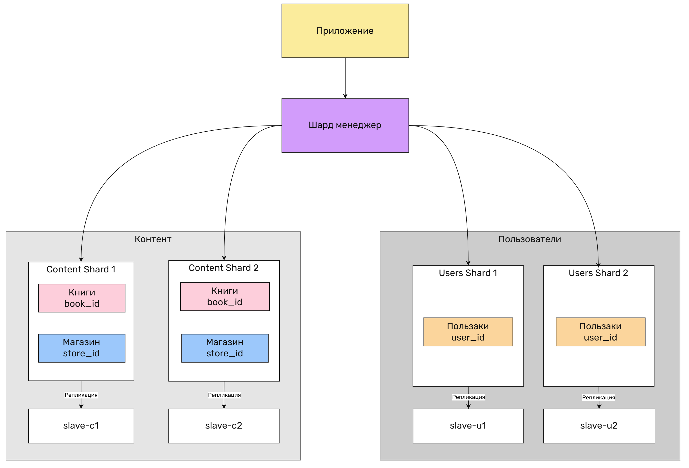

# sdb-homeworks_12-07
# Задание к занятию «Репликация и масштабирование. Часть 2»

---

### Задание 1

Опишите основные преимущества использования масштабирования методами:

- активный master-сервер и пассивный репликационный slave-сервер; 
- master-сервер и несколько slave-серверов;

*Дайте ответ в свободной форме.*

### Ответ на задание 1

Master+Slave

Плюсы:
 - Отказаустойчивость, в случии если сервер-master упал, то руками быстро переключаем на резервный сервер-slave
 - Резервное копирование без нагрузки сервер-master, просто делаем бекапы сервер-slave и не нагружаем основной
 - Разделение обязанностей, мастер допустим используется для записи, а слейв для чтения

Master+Slave+Slave+Slave...

Плюсы:
 - Умножает вышеперечисленное
 - Больше шагов отказа и резервирования
 - Высокая производительность, система сможет обрабатывать больше запросов при должном разделении обязанностей
---

### Задание 2

Разработайте план для выполнения горизонтального и вертикального шаринга базы данных. База данных состоит из трёх таблиц: 

- пользователи, 
- книги, 
- магазины (столбцы произвольно). 

Опишите принципы построения системы и их разграничение или разбивку между базами данных.

*Пришлите блоксхему, где и что будет располагаться. Опишите, в каких режимах будут работать сервера.* 

### Ответ на задание 2

